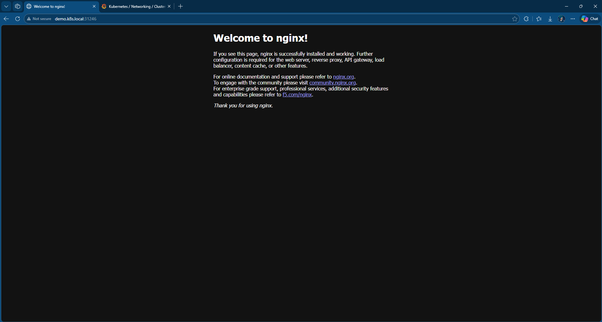
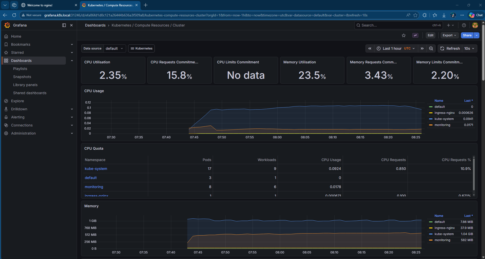
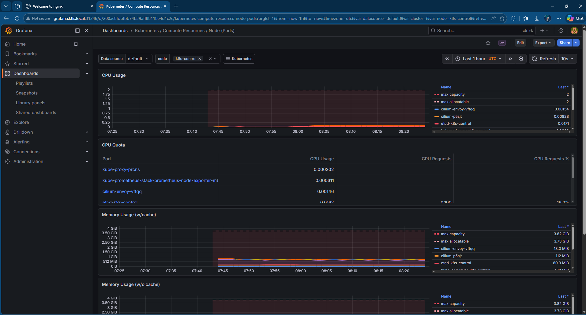
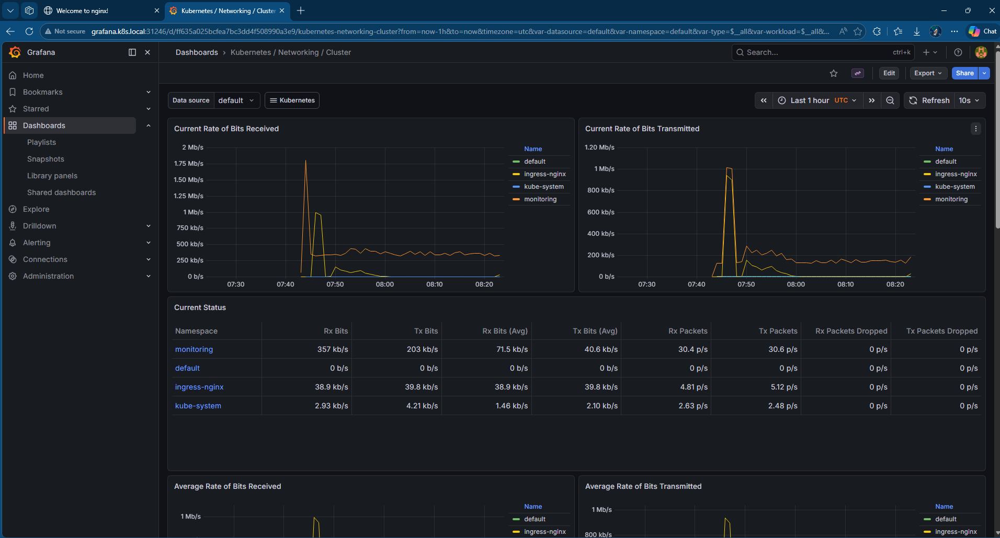

# k8s-homelab

A desktop-hosted, multi-node Kubernetes platform lab built on Hyper-V and operated from WSL2. This project demonstrates end-to-end infrastructure and platform engineering — from bare VM provisioning through cluster bootstrap, networking, observability, and CI/CD.


---

## Stack

| Layer | Technology |
|-------|-----------|
| Hypervisor | Hyper-V (Windows 11 Pro) |
| Operating System | Ubuntu 24.04 Server |
| Operator Workstation | WSL2 (Ubuntu 24.04) |
| Configuration Management | Ansible |
| Cluster Bootstrap | kubeadm |
| Container Runtime | containerd (Docker repo) |
| CNI | Cilium 1.16 (eBPF) |
| Ingress | NGINX Ingress Controller |
| Observability | Prometheus + Grafana (kube-prometheus-stack) |
| Package Management | Helm |
| CI/CD | GitHub Actions |

---

## Architecture

```
Windows 11 Pro (i7-13700K, 32GB RAM)
├── Hyper-V
│   ├── k8s-control     192.168.0.210  (2 vCPU, 4GB RAM)
│   ├── k8s-worker-01   192.168.0.211  (2 vCPU, 6GB RAM)
│   └── k8s-worker-02   192.168.0.212  (2 vCPU, 6GB RAM)
└── WSL2 (Ubuntu 24.04)
    ├── kubectl
    ├── helm
    ├── ansible
    └── git
```

Traffic flow:
```
Browser → NGINX Ingress Controller → ClusterIP Service → Pods
```

---

## Screenshots

### Demo App — Served via NGINX Ingress


### Grafana — Cluster Compute Resources


### Grafana — Node Pod Resources


### Grafana — Cluster Networking (Cilium)


---

## What This Project Demonstrates

**Infrastructure & Virtualization**
- Built and managed Ubuntu Server VMs on Hyper-V
- Resource planning and allocation on a desktop host
- Static IP assignment via netplan, hostname management, /etc/hosts

**Linux Systems Administration**
- SSH key-based authentication
- Kernel module and sysctl tuning for Kubernetes
- systemd service management
- Package management and version pinning

**Kubernetes Platform Engineering**
- Control plane bootstrap with kubeadm
- Worker node join mechanics
- CNI installation and eBPF networking with Cilium
- Ingress routing and north-south traffic delivery
- Observability stack deployment and validation

**DevOps & Automation**
- Ansible playbooks for repeatable node configuration
- Helm-driven platform installs
- GitHub Actions CI pipeline on every push
- Git-based workflow and infrastructure as code

---

## Cluster Setup

### Prerequisites
- Windows 11 Pro with Hyper-V enabled
- WSL2 running Ubuntu 24.04
- Ubuntu 24.04 Server ISO

### Operator Tools (WSL2)
```bash
sudo apt install -y ansible curl git vim net-tools openssh-client

# kubectl
curl -LO "https://dl.k8s.io/release/$(curl -sL https://dl.k8s.io/release/stable.txt)/bin/linux/amd64/kubectl"
sudo install -o root -g root -m 0755 kubectl /usr/local/bin/kubectl

# Helm
curl https://raw.githubusercontent.com/helm/helm/main/scripts/get-helm-3 | bash
```

### Node Configuration
```bash
ansible-playbook -i ansible/inventory.ini ansible/k8s-prep.yml -K
```

### Cluster Bootstrap
```bash
# On control node
sudo kubeadm init \
  --control-plane-endpoint=192.168.0.210 \
  --pod-network-cidr=10.244.0.0/16 \
  --apiserver-advertise-address=192.168.0.210

# Copy kubeconfig to WSL2
scp -i ~/.ssh/k8s_lab brooks@192.168.0.210:~/.kube/config ~/.kube/config
```

### Install Cilium
```bash
helm repo add cilium https://helm.cilium.io/
helm install cilium cilium/cilium --version 1.16.0 \
  --namespace kube-system \
  --set ipam.mode=kubernetes
```

### Verify
```bash
kubectl get nodes
kubectl get pods -n kube-system
```

---

## Ingress

NGINX Ingress Controller installed via Helm:
```bash
helm repo add ingress-nginx https://kubernetes.github.io/ingress-nginx
helm install ingress-nginx ingress-nginx/ingress-nginx \
  --namespace ingress-nginx \
  --create-namespace
```

Demo application deployed with Deployment, ClusterIP Service, and Ingress resource — accessible at `http://demo.k8s.local:31246`.

---

## Observability

kube-prometheus-stack deployed via Helm providing:
- Prometheus — metrics collection
- Grafana — dashboards and visualization
- Node Exporter — per-node system metrics
- kube-state-metrics — Kubernetes object metrics

```bash
helm repo add prometheus-community https://prometheus-community.github.io/helm-charts
helm install kube-prometheus-stack prometheus-community/kube-prometheus-stack \
  --namespace monitoring \
  --create-namespace
```

Grafana accessible at `http://grafana.k8s.local:31246`.

---

## CI/CD

GitHub Actions pipeline runs on every push to `main`:
- YAML syntax validation
- Kubernetes manifest dry-run validation
- Helm chart linting
- Pipeline summary report

See `.github/workflows/ci.yaml`.

---

## Repository Structure

```
k8s-homelab/
├── .github/
│   └── workflows/
│       └── ci.yaml
├── ansible/
│   ├── inventory.ini
│   └── k8s-prep.yml
├── docs/
│   ├── architecture.md
│   └── setup.md
├── k8s/
│   ├── demo-app.yaml
│   └── grafana-ingress.yaml
└── README.md
```

---

## Troubleshooting

See [docs/setup.md](docs/setup.md) for the full troubleshooting log including:
- SSH host key generation failure
- WSL2 → Hyper-V network routing
- kubeadm conntrack preflight error
- Hyper-V VHDX import conflicts
